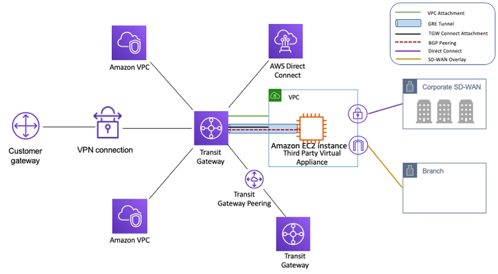

# Projects

You are in the projects section. 

Here, you will find a selection of the work I got the chance to contribute/create. 

They are academical/personal & professionnal.

Most of the projects below are made in groups. 

Explore this section to discover how I apply my knowledge to create impactfull and concrete solutions.

## Cooloc

### :lucide-book-open: About 

Cooloc is a website developed to obtain the [RNCP](https://www.francecompetences.fr/recherche/rncp/37873/) “Concepteur Développeur d’Applications” (CDA) certification. Cooloc aims to simplify shared-housing management.

All the project documentation is located in the `/backups` folder. 

I made everything Open Source because that’s what development is all about: sharing :handshake:

### :lucide-layers: Stack

:simple-github:{title="GitHub"} :fontawesome-brands-python:{title="Python"} :simple-react:{title="React"} :simple-postgresql:{title="PostgreSQL"} :simple-firebase:{title="Firebase"} :simple-docker:{title="Docker"} :simple-githubactions:{title="GitHub Actions"} :simple-sonarqubecloud:{title="SonarQube Cloud"}

### :lucide-link: Links

- [Github :simple-github:](https://github.com/MathieuAudibert/Cooloc)
- [Presentation :simple-googleslides:](https://docs.google.com/presentation/d/1Y5bW8WoPRExJGA21GxMHyY46XTlmjm0y1gQCe2c5fsE/edit)
- [Report :simple-googledocs:](https://docs.google.com/document/d/1N-IaB4XX8bFHh0D9jEAmT1BzQz1PJqrzT2tkXwD2LsI/edit?usp=sharing)

## BlockChain

### :lucide-book-open: About

Understanding basic cryptographics through this Python project.

I learned how to :

- [x] Create my own token (Tekra)
- [x] Create blocks of this token (or transactions with any other tokens/currency)
- [x] Create block-chains for these blocks
- [x] Create result files and logs dated
- [x] Setup properly Sonarqube, Python & Pytest/Tox

### :lucide-layers: Stack

:simple-github:{title="GitHub"} :fontawesome-brands-python:{title="Python"} :simple-docker:{title="Docker"} :simple-githubactions:{title="GitHub Actions"} :simple-sonarqubecloud:{title="SonarQube Cloud"}

### :lucide-link: Links

- [GitHub :simple-github:](https://github.com/MathieuAudibert/BlockChain)
- [Docker image :simple-docker:](https://hub.docker.com/repository/docker/cap92/blockchainspython)

## TGW-Reporting

### :lucide-book-open: About

Little Open-Source python script to report [transit-gateways](https://docs.aws.amazon.com/vpc/latest/tgw/what-is-transit-gateway.html) of aws :fontawesome-brands-aws: account(s).

- [x] List and storage in a python script all of the TGW in a AWS acc.
- [x] Creates output files in .json and .r format
- [ ] Strong unit testing for the account
- [x] Assume role tuto (Security ++)
- [x] Github actions to have a better run sort of report

### :lucide-layers: Stack

:simple-github:{title="GitHub"} :fontawesome-brands-python:{title="Python"} :fontawesome-brands-aws:{title="AWS"} :simple-githubactions:{title="GitHub Actions"}

### :lucide-link: Links

- [GitHub :simple-github:](https://github.com/MathieuAudibert/TGW-Reporting)

## DevOps

### :lucide-book-open: About

This project allowed us to put into practice the fundamentals of DevOps culture: automation, collaboration, and continuous deployment. 

Even though the application is simple, most of our work focused on the infrastructure and delivery pipeline.

We used:

- [x] Docker :simple-docker: to isolate services (frontend, backend, database),
- [x] Ansible :simple-ansible: to automate deployment on an Azure VM,
- [x] GitLab CI :simple-gitlab: to manage a complete pipeline (test, build, deploy),
- [x] And a rigorous use of Git :simple-git: with branches and merge requests.

### :lucide-layers: Stack

:simple-gitlab:{title="GitLab"} :simple-nodedotjs:{title="Node.js"} :simple-react:{title="React"} :simple-vite:{title="Vite"} :simple-mysql:{title="MySQL"} :fontawesome-brands-microsoft:{title="Microsoft Azure"} :simple-docker:{title="Docker"} :simple-ansible:{title="Ansible"}

### :lucide-link: Links

- [GitLab :simple-gitlab:](https://gitlab.com/mathieuaudibert1/devops)
- [Report :simple-googledocs:](https://docs.google.com/document/d/1tZXKpxXM3bd1ITAWqP1Z0WRz9vU0IkZRH0Nkc57SUDE/edit?tab=t.0)
- [Presentation :simple-googleslides:](https://docs.google.com/presentation/d/1Fm0I1w7z8tHO1HOV-wpempNVbB0-JY0kFJ9BSgK9pU0/edit)

## BankWerk

### :lucide-book-open: About

Objective: Build a banking platform

- [x] Create an account (`/register`)
- [x] Log in (`/login`)
- [x] View your balance (`/dashboard`)
- [x] View cryptocurrency prices (`/cryptos`)
- [x] Make transfers between two accounts (`/transfer`)
- [x] Perform buy/sell operations (`/buy` or `/transfer`)

### :lucide-layers: Stack

:simple-github:{title="GitHub"} :simple-nodedotjs:{title="Node.js"} :simple-react:{title="React"} :simple-nextdotjs:{title="Next.js"} :simple-firebase:{title="Firebase"} :simple-vercel:{title="Vercel"} :simple-githubactions:{title="GitHub Actions"} :simple-sonarqubecloud:{title="SonarQube Cloud"}

### :lucide-link: Links

- [Bankwerk.com](https://bankwerk.vercel.app/)
- [GitHub :simple-github:](https://github.com/MathieuAudibert/Reactjs-B3)

## AAVA 

### :lucide-book-open: About 

Design and development of a Symfony-based website aimed at supporting the monitoring and assistance of approximately 800,000 beneficiaries as part of the aid campaigns of the Mission Accompagnement Santé (MISAS), targeting insured individuals in vulnerable situations (chronic illnesses, pregnant women, elderly people, etc.). 

I worked on the entire full-stack part and implemented a DevOps approach.

### :lucide-layers: Stack

:simple-gitlab:{title="GitLab"} :simple-symfony:{title="Symfony"} :simple-postgresql:{title="PostgreSQL"}

### :lucide-link: Links

- Code owned by CPAM du Val de Marne :dizzy:

## Audiora 

### :lucide-book-open: About

Audiora is a music-streaming platform developed by @MathieuAudibert & @ismaa2k as part of a PHP skills-validation project.

- [x] Sign up / Log in
- [x] Search for a track
- [x] Listen to a track
- [x] Like a track
- [x] Have your own playlist

### :lucide-layers: Stack

:simple-github:{title="GitHub"} :simple-php:{title="PHP"} :simple-firebase:{title="Firebase"}

### :lucide-link: Links

- [GitHub :simple-github:](https://github.com/MathieuAudibert/PHP-Renforcement)