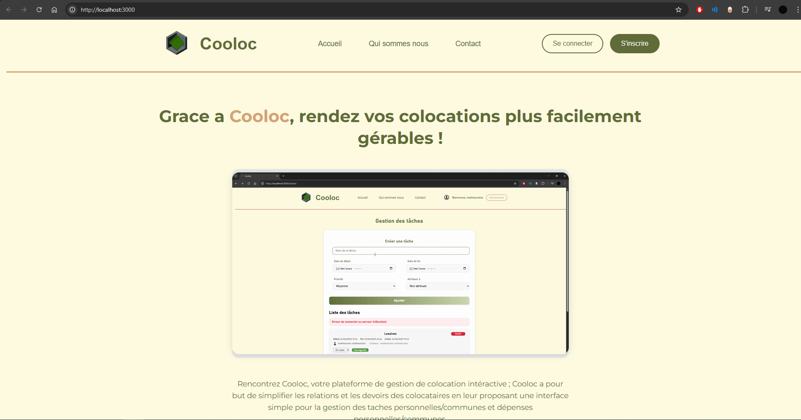
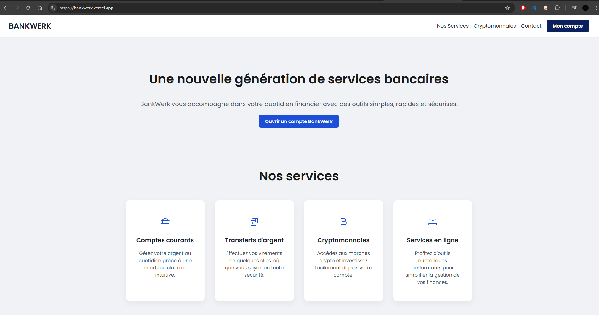
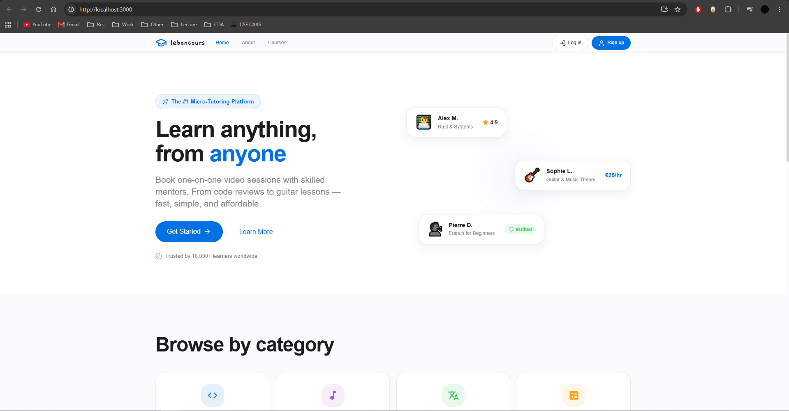
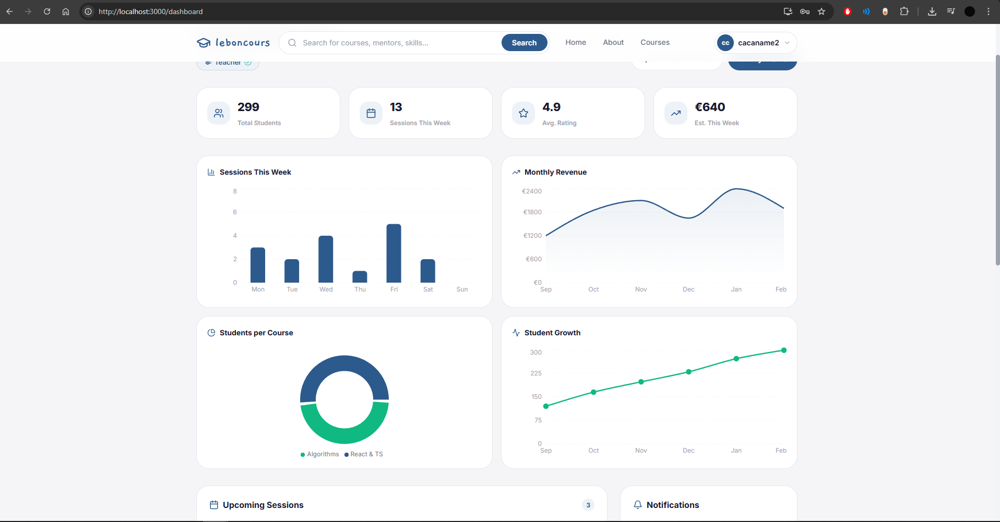
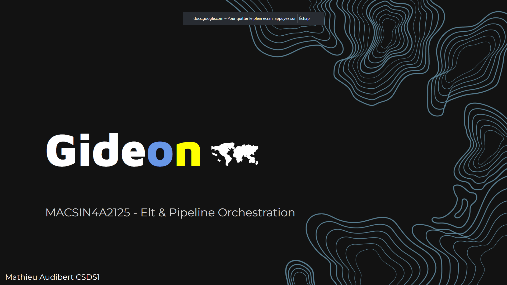
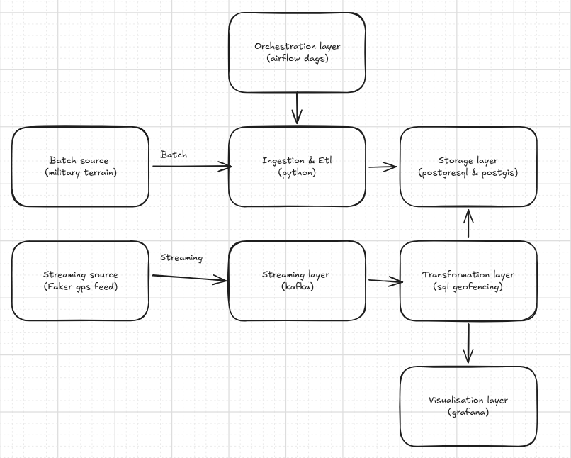

## Early Education

My journey in computer science began in middle school with Scratch and robotics courses. In high school, I focused on Python while studying graph theory, data structures, networking, and algorithms.

Completed a 3-year "Development & Data" engineering bachelor's degree at Efrei Panthéon Assas, earning the RNCP37873 certification ([Cooloc](#cooloc)).

## Efrei

Studied technical subjects including:

- Java & OOP (Spring Boot)
- JavaScript/Node.js
- PHP (Symfony, Composer)
- SQL & database management (MySQL, PostgreSQL, MongoDB)
- UML
- Web development (APIs, protocols)
- Source control (Git, GitHub, GitLab)
- Linux systems
- Frontend design (Figma, React)
- DevOps (SonarQube, GitHub Actions)
- Cybersecurity (OWASP, Bitwarden)

Alongside these: English, agile methodology, and project management.

### Cooloc
  
#### :lucide-library: About
 
Cooloc is a shared-housing management platform built to simplify colocation life. From organising bills to coordinating flatmates, it centralises everything a shared flat needs into one web application.
  

The certification required a complete conception and development lifecycle of a web application — from design through technical choices, code implementation, and security. The full documentation can be found in the `backup/` directory.

---
 
#### :lucide-layers: Tech Stack
 
**Backend**
 
| | |
|---|---|
| Language | Python |
| HTTP Server | Standard library `http.server` — no framework, fully hand-rolled routing & request handling |
| Testing | tox |
 
**Frontend**
 
| | |
|---|---|
| Languages | JavaScript · CSS · HTML |
| Styling | Vanilla CSS |
 
**DevOps & Quality**
 
| | |
|---|---|
| Containerisation | Docker · docker-compose |
| CI/CD | GitHub Actions |
| Code Quality | SonarCloud (Bugs · Code Smells · Coverage) |
 
**Languages breakdown:** Python 47.1% · JavaScript 36.2% · CSS 15.1% · HTML 1.5% · Dockerfile 0.1%
 
---
 
#### :lucide-git-branch: Releases
 
| Version | Date |
|---|---|
| V1.0 (Latest) | July 2, 2025 |
 
[View on GitHub](https://github.com/mathieu-personal-projects/Cooloc) :simple-github:
 
---

### BankWerk
  
#### :lucide-library: About
 
BankWerk is a crypto-oriented banking platform built as a React deep-dive exercise. The goal was to practise state management, routing, and component architecture while building a realistic banking UI with live cryptocurrency price tracking.
 

 
---
 
#### :lucide-layers: Tech Stack
 
**Frontend**
 
| | |
|---|---|
| Framework | Next.js |
| Language | JavaScript (JSX) · CSS |
| Routing | Next.js App Router |
| Data | External crypto price API |
 
**Languages breakdown:** JavaScript 78.4% · CSS 21.6%
 
---
 
#### :lucide-users: Team
 
| Name | GitHub |
|---|---|
| Mathieu Audibert | [@MathieuAudibert](https://github.com/MathieuAudibert) |
| Romeo Agostino | [@RomeoAg13](https://github.com/RomeoAg13) |
| Andrija Tomic | [@AndrijaFF](https://github.com/AndrijaFF) |
 
---
 
#### :lucide-git-branch: Releases
 
| Version | Date |
|---|---|
| V1.0 (Latest) | April 24, 2025 |
 
[View on GitHub](https://github.com/MathieuAudibert/Reactjs-B3) :simple-github:
 
---

## ESILV

Currently pursuing a Master of Engineering in Computer Science and Data Science at ESILV. Coursework includes:

- Python for data engineering (Pandas, FastAPI, Flask)
- Advanced networks
- Databases (Oracle, MongoDB, Neo4j, Elasticsearch)
- Containerization & DevOps (Kubernetes, Docker, GitHub Actions, JFrog, Terraform, Ansible)
- Digital Twins & IoT
- Advanced OOP (Java, Spring Boot)
- Web architecture (Rust, React, Bun, TypeScript)
- Cloud platforms (AWS, Google Cloud, Azure)
- Blockchain & digital trust
- Machine learning (scikit-learn)
- Data analysis (Polars, Jupyter)
- ETL pipelines (Apache Airflow, Kafka, Grafana, Spark, PostgreSQL)

Additionally: English courses and a scientific research paper in the 2nd year (see Upcoming section).

### Leboncours
  
#### :lucide-library: About
 
**Leboncours** is a Single Page Application that bridges casual learning and professional tutoring. Users sign up as **Teachers** or **Students**: teachers set their availability and offer courses, students browse and book sessions. The platform features an **Admin** role, an integrated **messaging system**, and a **dashboard with charts**.

It supports quick, one-off bookings for video call sessions on any skill — from code review to guitar tuning.
 

 

 
---
 
#### :lucide-layers: Tech Stack
 
**Backend**
 
| | |
|---|---|
| Language | Rust (Edition 2024) |
| Framework | Axum 0.7 |
| Async Runtime | Tokio |
| ORM | SeaORM 1.1 (PostgreSQL via sqlx) |
| API Docs | Utoipa + Swagger UI |
| Auth | Argon2 (password hashing) + JWT |
| Validation | validator · tower-http (CORS) |
 
**Database**
 
| | |
|---|---|
| System | PostgreSQL |
| Schema | Raw SQL (`db/create_table.sql`) |
 
**Frontend**
 
| | |
|---|---|
| Framework | React 19 |
| Language | JavaScript (JSX) |
| Routing | react-router-dom 7 |
| Data Grid | AG Grid React 35 |
| Charts | Recharts |
| Icons | Lucide React · React Icons |
| Auth State | React Context + sessionStorage |
 
**Languages breakdown:** JavaScript 40% · CSS 30% · Rust 29.5%
 
---
 
#### :lucide-plug: API Highlights
 
Base URL: `http://127.0.0.1:3001` · Swagger UI at `/swagger-ui`
 
Full REST CRUD on: `auth` · `users` · `courses` · `availabilities` · `event-courses` · `teacher-courses` · `messages` · `message-users`
 
---
 
[View on GitHub](https://github.com/MathieuAudibert/leboncours) :simple-github: 
 
---

### Gideon
  
#### :lucide-library: About
 
**Gideon** is a military topology interactive map powered by a complete ETL + ELT + streaming pipeline. It ingests two open GeoJSON datasets from the [Humanitarian Data Exchange](https://data.humdata.org) — *Ukraine Roads* and *Ukraine Points of Interest* — into PostGIS, builds analytics tables, replays events through Kafka, and renders everything in a live Grafana dashboard.

> **Note:** This project's purpose is solely to map the important geographic points of Ukraine.
 

 
---
 
#### :lucide-layers: Tech Stack
 
| Component | Technology |
|---|---|
| **Orchestration** | Apache Airflow |
| **Streaming** | Apache Kafka |
| **Database** | PostgreSQL + PostGIS |
| **Monitoring** | Grafana |
| **Pipeline** | Python (97.5%) |
| **Containerisation** | Docker / docker-compose |
 
---
 
#### :lucide-workflow: Architecture
 
The pipeline follows a complete **ETL → ELT → Streaming** flow:
 
1. **Extract** — raw GeoJSON data fetched from Humanitarian Data Exchange
2. **Load** — ingested into PostGIS with spatial indexing
3. **Transform** — SQL analytics tables built on top of raw data
4. **Stream** — events replayed through Kafka topics
5. **Visualise** — live Grafana dashboard served at `localhost:3000`

Main orchestration DAG: `src/orchestration/dags/raw_data_ingestion.py`
 
---
 
#### :lucide-database: Data Sources
 
| Dataset | Source |
|---|---|
| Ukraine Roads | [HOTOSM via HDX](https://data.humdata.org/dataset/hotosm_ukr_roads) |
| Ukraine Points of Interest | [HOTOSM via HDX](https://data.humdata.org/dataset/hotosm_ukr_points_of_interest) |
 
---
