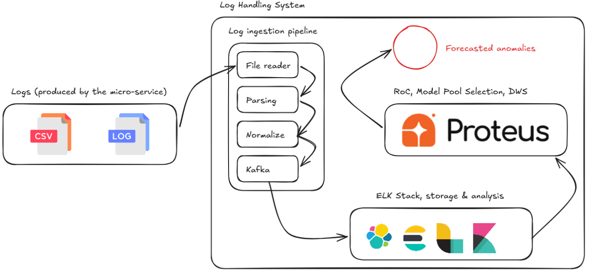

# Research & Thesis

My Master's program includes a research component exploring contemporary topics in data engineering and distributed systems.

## Intelligent Monitoring of Microservices Prototype

**Abstract** — Modern microservice platforms emit large volumes of logs and telemetry that exceed the capacity of manual inspection. This demo paper presents Proteus, a monitoring prototype designed for heterogeneous distributed environments. The system combines ingestion, normalization, feature extraction, and adaptive anomaly detection into a single workflow that can be demonstrated live.

The core contribution is a dynamic model-selection mechanism guided by the Region of Competence (RoC) and Dynamic Weight Selection (DWS). Instead of relying on one static detector, Proteus evaluates the local context of each event, selects the most appropriate model from a heterogeneous pool that includes Isolation Forest, LSTM, and language-model-based reasoning, and adjusts the contribution of each model according to the current operating regime.

The prototype targets operators, SRE teams, and researchers who need practical support for monitoring microservice platforms where normal behavior evolves quickly and failure patterns are diverse.

*Index Terms — microservices, monitoring, anomaly detection, dynamic weight selection, log analysis*

